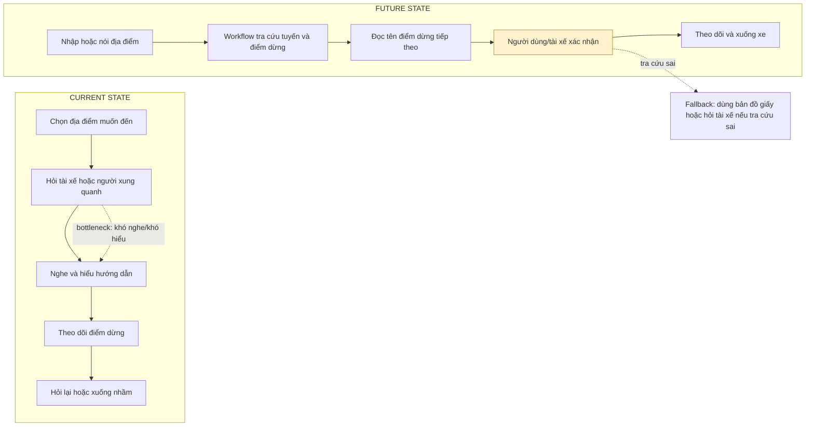
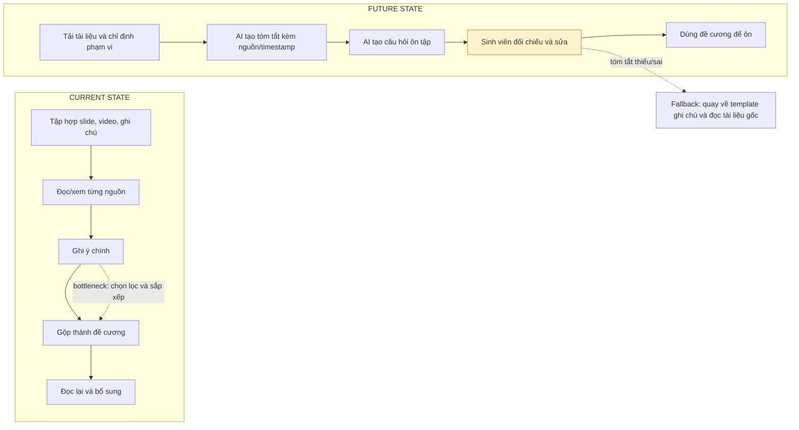
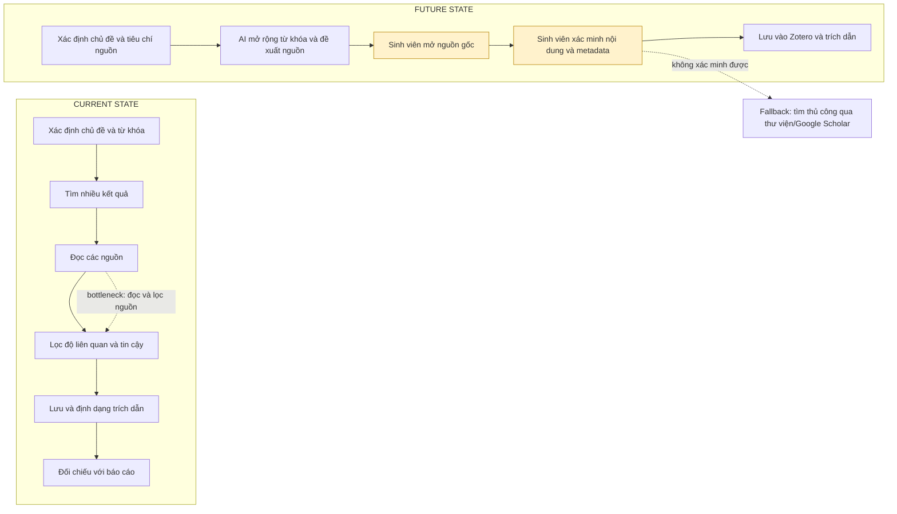

# 01 — Individual Problem Scan

> Điền theo Phase 1 + Phase 2 trong `01-worksheet.md`. Tự scan trước, dùng AI sau để phản biện. Không copy ví dụ Weekly Report.

## Thông tin cá nhân

- Họ và tên: Vũ Đức Minh
- Mã học viên: 2A202602895
- Vai trò / bối cảnh (VD: sinh viên năm X, intern PM, ...): Sinh viên năm cuối UET
- Công việc hằng tuần (3-5 gạch đầu dòng để soi problem):
    - Đi đến trường, nơi làm việc bằng xe bus
    - Survey các bài báo cập nhật thông tin về AI
    - Nghiên cứu, báo cáo khóa luận hàng tuần
    - Làm bài tập nhóm trên trường
    - Thảo luận với nhóm các project trên trường / chỗ thực tập

---

## Phase 1 — Scan 5+ problems (tối thiểu 5, khuyến khích 8-10)

**Cách điền:** mỗi dòng = việc gì + ai chịu + đo bằng gì. Cột `Dấu hiệu thật` bắt buộc có số: mất bao lâu (bấm giờ mấy lần), mấy lần/tuần, bao nhiêu người gặp, log/ticket/quote nào.

> Lưu ý: các số liệu ở dòng #2–#10 dưới đây là số liệu khởi tạo để soi problem; cần kiểm chứng và thay bằng số liệu thực tế trước khi nộp.

| # | Lăng kính (Lặp lại / Tốn thời gian / AI có thể tốt hơn / Pain từ người khác) | Problem quan sát được | Ai chịu ảnh hưởng? | Dấu hiệu thật (số + bằng chứng) |
|---|---|---|---|---|
| 1 |Pain từ người khác|Thắc mắc về địa điểm với tài xế khi đi bus |Người già|Khi đi xe buýt thường xuyên gặp 1,2 TH|
| 2 | Lặp lại | Tổng hợp tiến độ bài tập nhóm từ nhiều tin nhắn và file khác nhau | Thành viên nhóm | Xảy ra 1 lần/tuần, mất khoảng 20–30 phút; thường phải hỏi lại 2–3 người |
| 3 | Tốn thời gian | Tìm lại quyết định, deadline hoặc tài liệu cũ trong Discord/Messenger | Thành viên nhóm | Xảy ra 2–3 lần/tuần, mỗi lần mất khoảng 10–15 phút |
| 4 | Tốn thời gian | Đọc nhiều tài liệu để hiểu yêu cầu của một bài tập hoặc đồ án | Sinh viên | Mỗi tuần 1–2 lần, mất khoảng 30–60 phút/lần |
| 5 | Pain từ người khác | Thành viên thường hỏi lại ai phụ trách việc gì và deadline là khi nào | Các thành viên trong nhóm | Có khoảng 3–5 câu hỏi lặp lại mỗi tuần trong nhóm chat |
| 6 | Lặp lại | Sắp xếp lịch họp nhóm phù hợp với thời gian rảnh của mọi người | Trưởng nhóm và thành viên | Mỗi tuần cần sắp xếp 1–2 buổi, mất khoảng 10–20 phút |
| 7 | Tốn thời gian | Kiểm tra bài báo cáo có thiếu mục hoặc sai format theo rubric không | Người viết và người nộp bài | Mỗi lần nộp mất khoảng 15–20 phút kiểm tra; thường phải sửa 1–2 lần |
| 8 | AI có thể tốt hơn | Tóm tắt slide, video bài giảng và ghi chú thành nội dung ôn tập | Sinh viên | Có 2–3 môn cần ôn mỗi tuần, mất khoảng 45–90 phút/môn |
| 9 | Tốn thời gian | Tìm nguồn tham khảo và trích dẫn phù hợp cho báo cáo hoặc đồ án | Sinh viên làm báo cáo | Mỗi tuần mất khoảng 1–2 giờ, phải xem 5–10 nguồn |
| 10 | Lặp lại | Gộp nội dung từ nhiều thành viên thành một file báo cáo hoặc slide thống nhất | Người tổng hợp | Mỗi đồ án có 2–4 lần chỉnh sửa, mỗi lần mất khoảng 30–60 phút |

> Gợi ý tự soi: tuần trước mất nhiều thời gian nhất vào việc gì? Việc gì hay trì hoãn? Người khác hay hỏi lại câu gì? Workflow nào ai cũng biết là chậm?

**AI đã dùng ở Phase 1 (nếu có):**
- Prompt đã hỏi:
- Ý dùng được:
- Ý bỏ vì không phải pain thật:

**Self-check Phase 1:**
- [x] Đủ 5+ dòng, mỗi dòng có actor + số đo cụ thể
- [x] Dùng ít nhất 3/4 lăng kính
- [x] Không có dòng chung chung kiểu "mất nhiều thời gian"

---

## Phase 2 — Top 3 Problem Cards

### 2.1. Chọn top 3

Giữ bài nào: actor cụ thể, workflow vẽ được 3-7 bước, bottleneck ở 1 bước, impact đo được. Loại bài quá rộng.

| Rank | Problem (copy từ bảng scan) | Vì sao chọn (2-3 ý) | Điều còn chưa chắc |
|---|---|---|---|
| 1 | Thắc mắc về địa điểm với tài xế khi đi bus | Actor khá cụ thể; có thể vẽ workflow hỏi và xác nhận điểm xuống; vấn đề ảnh hưởng trực tiếp đến khả năng tự đi xe buýt của người cao tuổi | Chưa có số liệu chính xác về số lần hỏi lại, thời gian chờ và số trường hợp lỡ điểm |
| 2 | Tóm tắt slide, video bài giảng và ghi chú thành nội dung ôn tập | Xảy ra thường xuyên ở nhiều môn; workflow gồm nhiều nguồn tài liệu; thời gian đọc và tổng hợp có thể đo được | Cần kiểm chứng bản tóm tắt có giữ đủ ý quan trọng và giúp ôn tập tốt hơn không |
| 3 | Tìm nguồn tham khảo và trích dẫn phù hợp cho báo cáo hoặc đồ án | Có bottleneck rõ ở bước lọc nguồn; impact là thời gian làm báo cáo; có thể so sánh tìm thủ công với workflow có AI hỗ trợ | Chưa chắc AI có tìm được nguồn học thuật đáng tin và trích dẫn đúng hay không |

### 2.2. Problem Cards chi tiết (lặp lại cho cả 3 cards)

---

#### Problem Card #1 — Người cao tuổi khó hỏi địa điểm khi đi xe buýt

```text
Problem 1 câu: Người cao tuổi gặp khó khăn khi hỏi và xác nhận địa điểm xuống xe với tài xế xe buýt.

Actor: Người cao tuổi đi xe buýt; tài xế là người hỗ trợ/xác nhận thông tin.

Thời điểm / bối cảnh: Khi người cao tuổi đi một tuyến xe buýt quen hoặc đi đến địa điểm không quen.

Current workflow 3-7 bước:
1. Người cao tuổi xác định địa điểm muốn đến.
2. Hỏi tài xế hoặc người xung quanh về điểm xuống.
3. Nghe và cố gắng hiểu hướng dẫn.
4. Theo dõi các điểm dừng trong suốt chuyến đi.
5. Hỏi lại hoặc xác nhận khi gần đến nơi.

Bottleneck: Hỏi và hiểu thông tin điểm xuống; người cao tuổi có thể nghe không rõ, không biết tên điểm dừng hoặc phải hỏi lại.

Impact: Tăng sự phụ thuộc vào tài xế/người khác, gây lo lắng và có nguy cơ xuống nhầm hoặc lỡ điểm.

Success metric: Mong muốn trong khảo sát thực tế sẽ giảm được số lần hỏi, hay xuống nhầm của người lớn tuổi (khó trong việc đưa ra con số cụ thể)

Non-AI alternative: Bảng điểm dừng chữ lớn, bản đồ tuyến xe đơn giản, thông báo điểm dừng rõ ràng và hỗ trợ trực tiếp từ tài xế.

AI hypothesis: Một workflow tra cứu bằng giọng nói nhận điểm đến, hiển thị/đọc tên điểm dừng tiếp theo và yêu cầu người dùng xác nhận trước khi xuống.

Quick gut:
[ ] No AI / process fix
[ ] Rule
[x] Workflow
[ ] Agent
[ ] Chưa biết
```

**Draft workflow Card #1** (ASCII / Mermaid / ảnh đính kèm):



File đính kèm (nếu vẽ riêng): `01-individual-problem-scan-workflow-card-1.png`

---

#### Problem Card #2 — Tóm tắt tài liệu ôn tập

```text
Problem 1 câu: Sinh viên mất nhiều thời gian biến slide, video bài giảng và ghi chú rời rạc thành nội dung ôn tập có cấu trúc.

Actor: Sinh viên năm cuối UET.

Thời điểm / bối cảnh: Trước buổi kiểm tra, deadline bài tập hoặc khi cần ôn lại kiến thức của 2–3 môn trong tuần.

Current workflow 3-7 bước:
1. Tập hợp slide, video bài giảng và ghi chú.
2. Đọc hoặc xem lại từng nguồn.
3. Ghi các ý chính và khái niệm quan trọng.
4. Gộp nội dung thành đề cương ôn tập.
5. Đọc lại và kiểm tra các ý còn thiếu.

Bottleneck: Chọn lọc và sắp xếp ý chính từ nhiều nguồn; bước này dễ bị lặp lại hoặc bỏ sót nội dung.

Impact: Mất khoảng 45–90 phút cho mỗi môn, tương đương 90–270 phút mỗi tuần; thời gian dành cho luyện bài bị giảm.

Success metric: Giảm thời gian tổng hợp từ 45–90 phút xuống 20–30 phút/môn; bản tóm tắt được đối chiếu với tài liệu gốc và không bỏ sót các mục trong đề cương.

Non-AI alternative: Sử dụng template đề cương cố định, tự đánh dấu timestamp/trang tài liệu quan trọng.

AI hypothesis: AI tạo bản tóm tắt có cấu trúc, ghi rõ nguồn hoặc timestamp, sau đó sinh câu hỏi ôn tập để sinh viên kiểm tra mức hiểu.

Quick gut:
[ ] No AI / process fix
[ ] Rule
[x] Workflow
[ ] Agent
[ ] Chưa biết
```

**Draft workflow Card #2:**



File đính kèm: `01-individual-problem-scan-workflow-card-2.png`

---

#### Problem Card #3 — Tìm nguồn tham khảo và trích dẫn

```text
Problem 1 câu: Sinh viên mất nhiều thời gian tìm, lọc và định dạng nguồn tham khảo đáng tin cho báo cáo hoặc đồ án.

Actor: Sinh viên viết báo cáo hoặc làm đồ án.

Thời điểm / bối cảnh: Khi bắt đầu viết phần cơ sở lý thuyết, tổng quan hoặc cần bổ sung dẫn chứng cho báo cáo.

Current workflow 3-7 bước:
1. Xác định chủ đề và từ khóa tìm kiếm.
2. Tìm bài viết, tài liệu hoặc bài nghiên cứu.
3. Mở và đọc nhiều kết quả.
4. Lọc nguồn theo độ liên quan và độ tin cậy.
5. Lưu thông tin thư mục và định dạng trích dẫn.
6. Đối chiếu trích dẫn với nội dung báo cáo.

Bottleneck: Đọc và lọc nhiều kết quả để phân biệt nguồn phù hợp, đáng tin với nguồn không đủ chất lượng.

Impact: Mỗi tuần mất khoảng 1–2 giờ và phải xem 5–10 nguồn; báo cáo có nguy cơ dùng nguồn không phù hợp hoặc sai thông tin thư mục.

Success metric: Giảm thời gian tìm và lọc từ 60–120 phút xuống 30–45 phút; có ít nhất 5 nguồn liên quan được sinh viên mở và xác minh trước khi trích dẫn.

Non-AI alternative: Tìm trong Google Scholar/thư viện trường, dùng checklist đánh giá nguồn và Zotero để lưu, định dạng trích dẫn.

AI hypothesis: AI mở rộng từ khóa, gợi ý danh sách nguồn và trích xuất thông tin thư mục; sinh viên phải mở nguồn gốc và xác minh trước khi sử dụng.

Quick gut:
[ ] No AI / process fix
[ ] Rule
[x] Workflow
[ ] Agent
[ ] Chưa biết
```

**Draft workflow Card #3:**



File đính kèm: `01-individual-problem-scan-workflow-card-3.png`

---

### 2.3. Card muốn pitch nhất (chuẩn bị 2 phút)

**Card tôi muốn pitch nhất:**

```text
Problem Card #1 — Người cao tuổi khó hỏi địa điểm khi đi xe buýt
```

**Vì sao (2-3 câu: workflow gì, số đo gì, impact gì):**

```text
Card này có actor cụ thể là người cao tuổi và workflow gồm các bước xác định địa điểm, hỏi thông tin, theo dõi điểm dừng và xác nhận trước khi xuống. Vấn đề có thể đo bằng số lần phải hỏi lại, số trường hợp xuống nhầm và thời gian xác nhận điểm xuống. Nếu vấn đề xảy ra thường xuyên, nó có thể giúp người cao tuổi tự tin và chủ động hơn khi đi xe buýt.
```

**Câu hỏi tôi muốn nhóm challenge (1-2 câu hỏi đúng chỗ yếu):**

```text
Vấn đề này xảy ra với tần suất đủ lớn ở bao nhiêu người cao tuổi, và đã có bằng chứng quan sát hoặc phỏng vấn nào chưa? Bảng điểm dừng chữ lớn hoặc thông báo rõ ràng có giải quyết được phần lớn vấn đề mà không cần AI không?
```

**AI phản biện Card (nếu có):**
- Điểm yếu AI chỉ ra: Chưa dùng AI phản biện ở Phase 2.
- Tôi sửa gì: Sẽ kiểm chứng thêm tần suất gặp vấn đề và so sánh với phương án không dùng AI.

### Self-check nộp phần 01
- [x] Có 5+ problems + top 3 Cards đủ field
- [x] Mỗi Card có workflow trước/sau + bottleneck + metric + fallback
- [x] Đã chọn 1 card pitch + câu hỏi challenge
